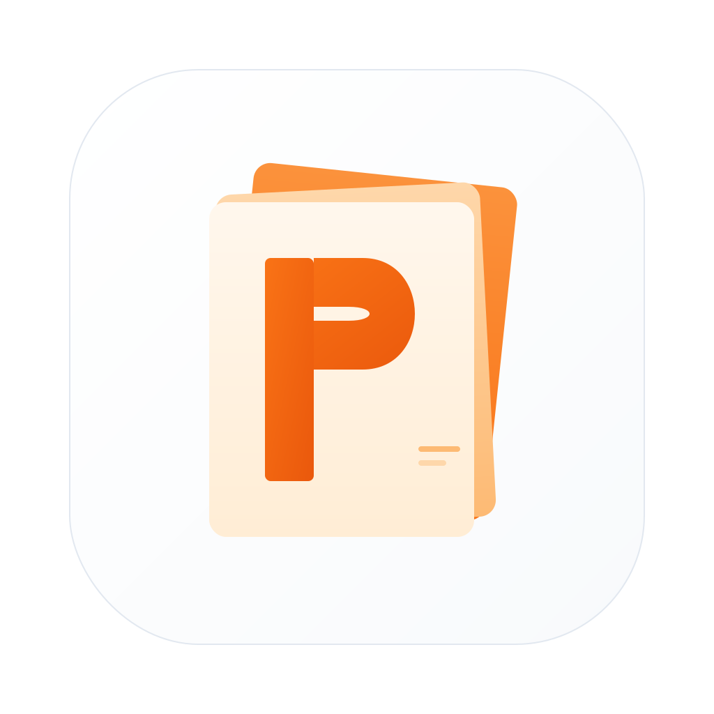
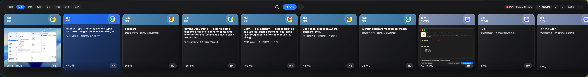
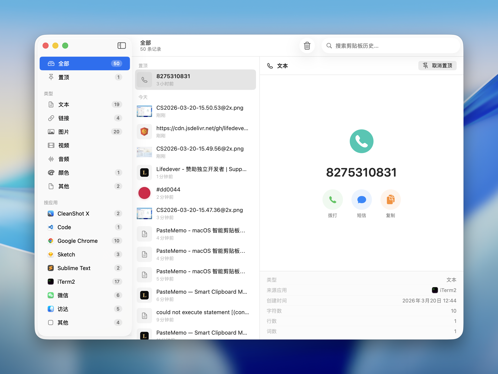
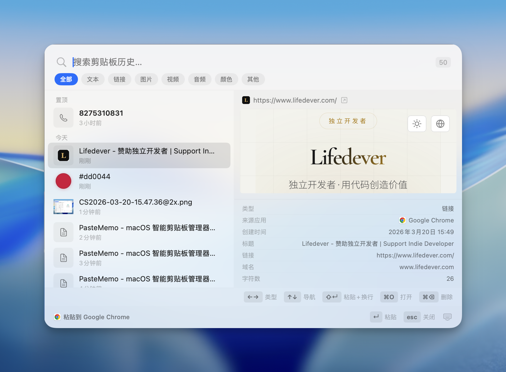
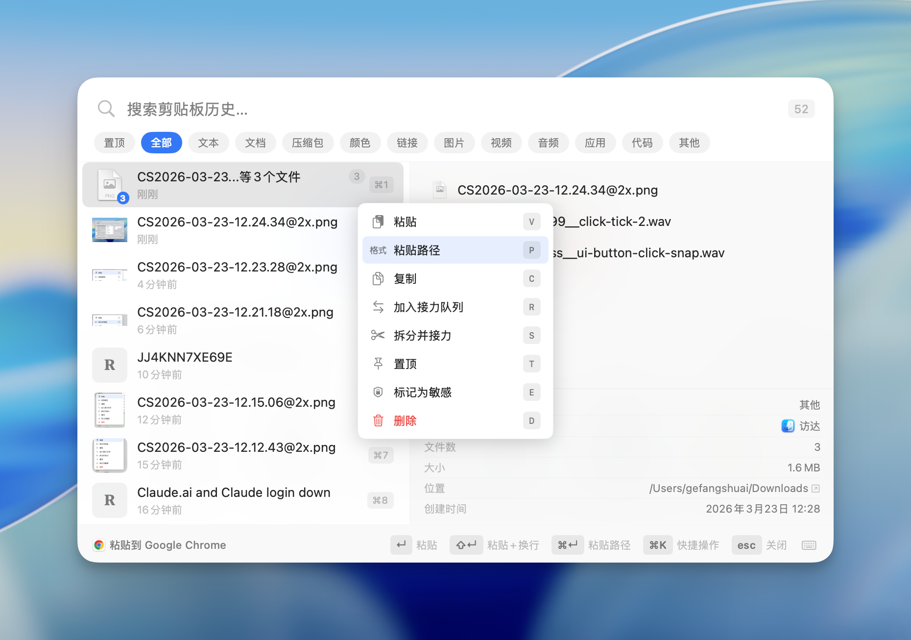
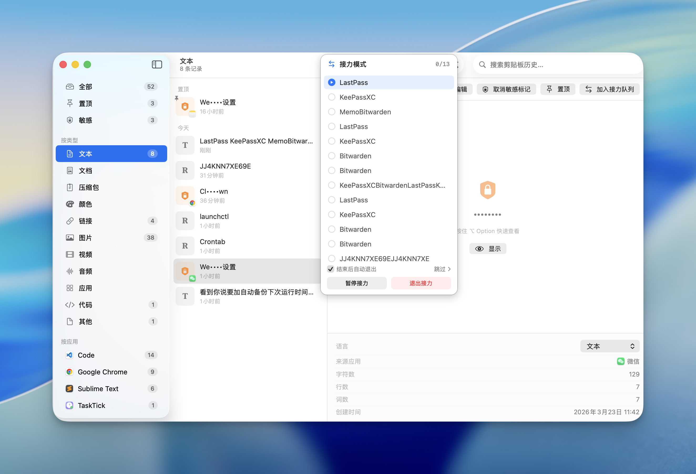

# PasteMemo

<p align="center">
  
</p>

<h3 align="center">PasteMemo</h3>

<p align="center">
  <strong>A smart clipboard manager for macOS.</strong><br>
  Copy once, access anywhere, paste instantly.
</p>

<p align="center">
  
  
</p>

<p align="center">
  <a href="https://github.com/hmilyfyj/PasteMemo-app/releases/latest">⬇️ Download</a>
</p>

<p align="center">
  <a href="README.md">中文文档</a>
</p>

---

## Screenshots


<p align="center">
  
</p>

<p align="center">
  
</p>


<p align="center">
  
</p>

<p align="center">
  
</p>

<p align="center">
  
</p>

<p align="center">
  
</p>

## Highlights

- **Copy -> File, Instantly** -- Paste copied text as a `.txt` file, paste screenshots as image files. Drag directly into Finder or any file dialog.
- **AI Terminal Ready** -- Seamlessly paste images and files into AI terminals. Built for developers who live in the command line.
- **Smart Recognition** -- Automatically detects content type -- links with favicons, code snippets, colors, phone numbers, files -- with intelligent previews.
- **Beyond Copy-Paste** -- Paste file paths, filenames, save to folders, or paste-and-enter for terminal commands. Every clip is a multi-tool.

## Features

### Clipboard Management

- **Automatic Capture** -- Monitors the system clipboard in real-time. Text, images, files, links, code -- everything is saved.
- **Content Type Detection** -- Automatically classifies content: text, links, images, code, colors, phone numbers, files, documents, archives, audio, video, and more.
- **Rich Preview** -- Links show live web previews with favicons. Code gets syntax highlighting. Colors display swatches. Phone numbers show action buttons.
- **OCR Support** -- Extract text from images using built-in OCR. Supports multiple languages including Chinese and English.
- **Pin to Top** -- Pin frequently used clips so they're always at the top of the list.
- **Smart Groups** -- Create intelligent groups that automatically organize clips based on rules.
- **Search** -- Full-text search across all clipboard history with highlighted results. Find anything instantly.
- **Filter by Type** -- Filter by content type: text, links, images, code, colors, files, etc.
- **Filter by App** -- See which app each clip came from. Filter by source -- Chrome, VS Code, Figma, Slack, etc.
- **History Retention** -- Configure how long to keep history: forever, or auto-delete after 1-365 days.

### Quick Paste Panel

- **Global Hotkey** -- Press Cmd+Shift+V (customizable, supports F1-F12) from anywhere to open the Quick Paste panel.
- **Switchable Panel Styles** -- Choose between the classic split panel and a new bottom-floating style in Settings.
- **Smooth Animations** -- Beautiful spring animations and micro-interactions for a polished experience.
- **Keyboard Navigation** -- Cmd+1 to Cmd+9 to paste directly. Arrow keys to navigate. Enter to paste. Full keyboard workflow.
- **Quick Actions (Cmd+K)** -- Command palette for paste, copy, pin, delete, and more -- all without leaving the keyboard.
- **Paste + Enter** -- Cmd+Enter pastes and presses Enter. Perfect for terminal commands and chat apps.

### Relay Mode

- **Batch Paste** -- Copy multiple items, then paste them one by one in order. Ideal for filling forms, data entry, or repetitive workflows.
- **Text Splitting** -- Split text by a delimiter (comma, newline, etc.) to quickly build a relay queue.
- **Visual Queue** -- See your relay queue with a clear list. Current item is highlighted. Progress is tracked.
- **Queue Management** -- Reorder, edit, skip, or delete items in the queue. Reverse the entire queue with one click.

### Clipboard Automation

- **Rule Engine** -- Define conditions + actions to automatically process clipboard content.
- **Auto Trigger** -- Rules run silently when you copy. E.g., auto-clean tracking parameters from URLs.
- **Manual Trigger** -- Apply transformations via the command palette or right-click menu.
- **Built-in Rules** -- Clean URL tracking params, lowercase emails, remove blank lines, and more.
- **Special Actions** -- Strip rich text, assign groups, mark as sensitive, pin items, or skip capture entirely.

### Backup & Sync

- **Local Backup** -- Automatic backups to local folders with configurable retention.
- **WebDAV Support** -- Sync backups to any WebDAV server (NAS, cloud storage, etc.).
- **Multi-Slot Rotation** -- Keep multiple backup versions (up to 10 slots) with automatic rotation.
- **Encrypted Backups** -- All backups are encrypted for security.
- **Easy Restore** -- Restore from any backup with merge or overwrite options.

### AI-Ready Features

- **AI Terminal Paste** -- Optimized paste format for AI terminals and chat interfaces.
- **Smart Formatting** -- Links become markdown, long text wrapped in blockquotes, images handled gracefully.
- **Perfect for Developers** -- Built for workflows involving AI assistants, terminal commands, and code snippets.

### Privacy & Security

- **Sensitive Detection** -- Automatically detects passwords and sensitive data, masks them in the UI.
- **Ignored Apps** -- Exclude specific apps (e.g., password managers) from clipboard monitoring.
- **Open Source** -- Full source code available. You know exactly what runs on your Mac.

### Data Migration

- **Import from Paste.app** -- Migrate your clipboard history from Paste.app seamlessly.
- **Export & Import** -- Export your data and import it on another Mac.

### Auto-Update

- **Sparkle Integration** -- Built-in auto-update framework for seamless updates.
- **Background Updates** -- Download updates in the background and install when ready.

### Customization

- **Themes** -- System, Light, or Dark mode.
- **Sound Effects** -- Customizable copy and paste sounds, or disable them entirely.
- **Animation Settings** -- Configure animation speed or disable animations entirely.
- **11 Languages** -- English, Simplified Chinese, Traditional Chinese, Japanese, Korean, German, French, Spanish, Italian, Russian, Indonesian

## Keyboard Shortcuts

| Shortcut | Action |
|----------|--------|
| Cmd+Shift+V (customizable) | Open/close Quick Paste panel |
| Cmd+1 - Cmd+9 | Paste the Nth item directly |
| Up / Down | Navigate history |
| Enter | Paste selected item |
| Shift+Enter | Contextual paste action (plain text / path) |
| Cmd+Enter | Paste and press Enter |
| Cmd+K | Open Quick Actions |
| Cmd+F | Focus search |
| Esc | Close panel |

## Requirements

- macOS 14 (Sonoma) or later
- Apple Silicon or Intel Mac

## Install

### Homebrew (Recommended)

```bash
brew tap lifedever/tap
brew install --cask pastememo
```

Update to the latest version:

```bash
brew upgrade --cask pastememo
```

### Download

Grab the latest `.dmg` from [Releases](https://github.com/hmilyfyj/PasteMemo-app/releases):

| File | Architecture |
|------|-------------|
| `PasteMemo-x.x.x-arm64.dmg` | Apple Silicon (M1/M2/M3/M4) |
| `PasteMemo-x.x.x-x86_64.dmg` | Intel Mac |

> On first launch: **Right-click PasteMemo.app -> Open -> Open**
>
> Or run: `xattr -cr /Applications/PasteMemo.app`

### Build from Source

```bash
git clone https://github.com/hmilyfyj/PasteMemo-app.git
cd PasteMemo
swift build
```

## Contributing

Contributions are welcome! Please open an issue first to discuss what you'd like to change.

## Sponsor

If PasteMemo is useful to you, consider [buying me a coffee](https://www.lifedever.com).

## Feedback

Found a bug or have a suggestion? [Open an issue](https://github.com/hmilyfyj/PasteMemo-app/issues).

## License

This project is licensed under the [GPL-3.0 License](LICENSE).

Copyright (c) 2026 lifedever.
